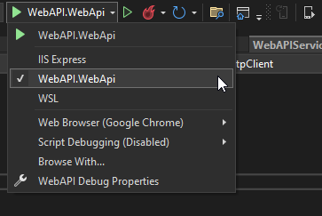

<!-- default badges list -->

[](https://supportcenter.devexpress.com/ticket/details/T1159573)
[](https://docs.devexpress.com/GeneralInformation/403183)
[](#does-this-example-address-your-development-requirementsobjectives)
<!-- default badges end -->
# Authenticate Users with the DevExpress Web API Service

This example demonstrates how to use our free [.NET App Security & Web API Service](https://www.devexpress.com/products/net/application_framework/security-web-api-service.xml) to implement user authentication based on simple, form-based authentication logic (login/password). A wizard helps you generate a ready-to-use authentication service. This service uses the [Entity Framework Core](https://docs.microsoft.com/en-us/ef/core/) ORM to access a database.    


You can find more information about our Web API Service's access restrictions in the following resources:

[Article: Create a Standalone Web API Application](https://docs.devexpress.com/eXpressAppFramework/403401/backend-web-api-service/create-new-application-with-web-api-service?p=net6)

[Video: A 1-Click Solution for CRUD Web API with Role-based Access Control via EF Core & ASP.NET](https://www.youtube.com/watch?v=T7y4gwc1n4w&list=PL8h4jt35t1wiM1IOux04-8DiofuMEB33G)

## Prerequisites

[SQL Server](https://www.microsoft.com/en-us/sql-server/sql-server-downloads), if you run this solution on Windows.

## Run Projects


1. Open the `WebAPI` solution. Run Visual Studio as an administrator so that the IDE can create the database as defined in `appsettings.json`.

2. Choose the `WebApi` item in the **debug** dropdown menu. This selection will debug the project on the [Kestrel](https://learn.microsoft.com/en-us/aspnet/core/fundamentals/servers/kestrel?view=aspnetcore-7.0) web server.

    

    If you prefer IIS Express to Kestrel, select **IIS Express** from the **debug** drop-down menu, and use an external text editor to add the following code to `.vs\MAUI_WebAPI\config\applicationhost.config`:

    ```xaml
    <sites>
        <site name="WebSite1" id="1" serverAutoStart="true">
        <!-* ... -->
            <bindings>
                <binding protocol="http" bindingInformation="*:65201:*" />
                <binding protocol="https" bindingInformation="*:44317:*" />
                <binding protocol="https" bindingInformation="*:44317:localhost" />
                <binding protocol="http" bindingInformation="*:65201:localhost" />
            </bindings>
        </site>
        <!-* ... -->
    </sites>
    ```

3. Right-click the MAUI project, choose `Set as Startup Project`, and select your emulator. Note that physical devices that are attached over USB do not allow you to access your machine's localhost.
4. Right-click the `WebAPI` project and select `Debug > Start new instance`.
5. Right-click the `MAUI` project and select `Debug > Start new instance`.

## Implementation Details

### Service and Communication

* DevExpress Web API Service uses JSON Web Tokens (JWT) to authorize users. Call `WebAPI`'s **Authenticate** endpoint and pass a username and password to the endpoint from the .NET MAUI application. In this example, token generation logic is implemented in the `WebAPIService.RequestTokenAsync` method:
  
    ```csharp
      private async Task<HttpResponseMessage> RequestTokenAsync(string userName, string password) {
            return await HttpClient.PostAsync($"{ApiUrl}Authentication/Authenticate",
                                                new StringContent(JsonSerializer.Serialize(new { userName, password = $"{password}" }), Encoding.UTF8,
                                                ApplicationJson));
      }
    ```

    Include the token in [HttpClient.DefaultRequestHeaders.Authorization](https://learn.microsoft.com/en-us/dotnet/api/system.net.http.headers.httprequestheaders.authorization?view=net-7.0). All subsequent requests can then access private endpoints and data: 

    ```csharp
    HttpClient.DefaultRequestHeaders.Authorization = new AuthenticationHeaderValue("Bearer", await tokenResponse.Content.ReadAsStringAsync());
    ```

  File to Look At: [WebAPIService.cs](CS/MAUI/Services/WebAPIService.cs)

* To create users and specify their passwords, use the `Updater.UpdateDatabaseAfterUpdateSchema` method. You can modify a user's password directly in the database or use the full version of our [XAF UI](https://docs.devexpress.com/eXpressAppFramework/112649/data-security-and-safety/security-system/authentication/passwords-in-the-security-system).

    File to Look At: [Updater.cs](CS/WebAPI/DatabaseUpdate/Updater.cs)

### Login UI and View Model

* Use the [TextEdit.StartIcon](https://docs.devexpress.com/MAUI/DevExpress.Maui.Editors.EditBase.StartIcon) and [PasswordEdit.StartIcon](https://docs.devexpress.com/MAUI/DevExpress.Maui.Editors.EditBase.StartIcon) properties to display icons in the [TextEdit](https://docs.devexpress.com/MAUI/DevExpress.Maui.Editors.TextEdit) and [PasswordEdit](https://docs.devexpress.com/MAUI/DevExpress.Maui.Editors.PasswordEdit) controls.

    ```xaml
    <dxe:TextEdit LabelText="Login" StartIcon="editorsname" .../>
    <dxe:PasswordEdit LabelText="Password" StartIcon="editorspassword" .../>
    ```

    File to Look At: [LoginPage.xaml](CS/MAUI/Views/LoginPage.xaml)

* To validate the [PasswordEdit](https://docs.devexpress.com/MAUI/DevExpress.Maui.Editors.PasswordEdit) control's value, use the [EditBase.HasError](https://docs.devexpress.com/MAUI/DevExpress.Maui.Editors.EditBase.HasError) and [EditBase.ErrorText](https://docs.devexpress.com/MAUI/DevExpress.Maui.Editors.EditBase.ErrorText) inherited properties.

    ```xaml
    <dxe:PasswordEdit ... HasError="{Binding HasError}" ErrorText="{Binding ErrorText}"/>
    ```

    File to Look At: [LoginPage.xaml](CS/MAUI/Views/LoginPage.xaml)

    ```csharp
    public class LoginViewModel : BaseViewModel {
        // ...
        string errorText;
        bool hasError;
        // ...

        public string ErrorText {
            get => errorText;
            set => SetProperty(ref errorText, value);
        }

        public bool HasError {
            get => hasError;
            set => SetProperty(ref hasError, value);
        }
        async void OnLoginClicked() {
            /// ...
            string response = await DataStore.Authenticate(userName, password);
            if (!string.IsNullOrEmpty(response)) {
                ErrorText = response;
                HasError = true;
                return;
            }
            HasError = false;
            await Navigation.NavigateToAsync<SuccessViewModel>();
        }
    }
    ```

    File to Look At: [LoginViewModel.cs](CS/MAUI/ViewModels/LoginViewModel.cs)


* Specify the [TextEdit.ReturnType](https://docs.devexpress.com/MAUI/DevExpress.Maui.Editors.EditBase.ReturnType) inherited property to focus the [PasswordEdit](https://docs.devexpress.com/MAUI/DevExpress.Maui.Editors.PasswordEdit) control after the [TextEdit](https://docs.devexpress.com/MAUI/DevExpress.Maui.Editors.TextEdit) control's value is edited.
* Bind the [PasswordEdit.ReturnCommand](https://docs.devexpress.com/MAUI/DevExpress.Maui.Editors.EditBase.ReturnCommand) property to the **Login** command to execute the command when a user enters the password:

    ```xaml
    <dxe:PasswordEdit ReturnCommand="{Binding LoginCommand}"/>
    ```

    File to Look At: [LoginPage.xaml](CS/MAUI/Views/LoginPage.xaml)
    
    ```csharp
    public class LoginViewModel : BaseViewModel {
        // ...
        public LoginViewModel() {
            LoginCommand = new Command(OnLoginClicked);
            SignUpCommand = new Command(OnSignUpClicked);
            PropertyChanged +=
                (_, __) => LoginCommand.ChangeCanExecute();

        }
        // ...
        public Command LoginCommand { get; }
        public Command SignUpCommand { get; }
        // ...
    }
    ```

    File to Look At: [LoginViewModel.cs](CS/MAUI/ViewModels/LoginViewModel.cs)


### Debug Specifics

Android emulator and iOS simulator request a certificate to access a service over HTTPS. In this example, we switch to HTTP in debug mode:

```csharp
#if !DEBUG
    app.UseHttpsRedirection();
#endif
```

#### MAUI - Android

```xml
<network-security-config>
    <domain-config cleartextTrafficPermitted="true">
        <domain includeSubdomains="true">10.0.2.2</domain>
    </domain-config>
</network-security-config>
```

#### MAUI - iOS

```xml
<key>NSAppTransportSecurity</key>
<dict>
    <key>NSAllowsLocalNetworking</key>
    <true/>
</dict>
```

This allows you to bypass the certificate check without the need to create a development certificate or implement HttpClient handlers.

For more information, please refer to [Connect to local web services from Android emulators and iOS simulators](https://learn.microsoft.com/en-us/dotnet/maui/data-cloud/local-web-services?view=net-maui-7.0#android-network-security-configuration).

**We recommend that you use HTTP only when you develop/debug your application. In production, use HTTPS for security reasons.**

## Files to Look At

* [WebAPIService.cs](CS/MAUI/Services/WebAPIService.cs)
* [Updater.cs](CS/WebAPI/DatabaseUpdate/Updater.cs)
* [LoginPage.xaml](CS/MAUI/Views/LoginPage.xaml)
* [LoginViewModel.cs](CS/MAUI/ViewModels/LoginViewModel.cs)

## Documentation

* [Featured Scenario: Authenticate](https://docs.devexpress.com/MAUI/404307)
* [Featured Scenarios](https://docs.devexpress.com/MAUI/404291)
* [Create a Standalone Web API Application](https://docs.devexpress.com/eXpressAppFramework/403401/backend-web-api-service/create-new-application-with-web-api-service?p=net6)

## More Examples

* [Role-Based Data Access with the DevExpress Web API Service](https://github.com/DevExpress-Examples/maui-role-based-data-access)
* [How to Create a Web API Service Backend for a .NET MAUI Application](https://www.devexpress.com/go/XAF_Security_NonXAF_MAUI.aspx)
* [DevExpress Mobile UI for .NET MAUI](https://github.com/DevExpress-Examples/maui-demo-app/)
<!-- feedback -->
## Does this example address your development requirements/objectives?

[](https://www.devexpress.com/support/examples/survey.xml?utm_source=github&utm_campaign=maui-authenticate&~~~was_helpful=yes) [](https://www.devexpress.com/support/examples/survey.xml?utm_source=github&utm_campaign=maui-authenticate&~~~was_helpful=no)

(you will be redirected to DevExpress.com to submit your response)
<!-- feedback end -->
